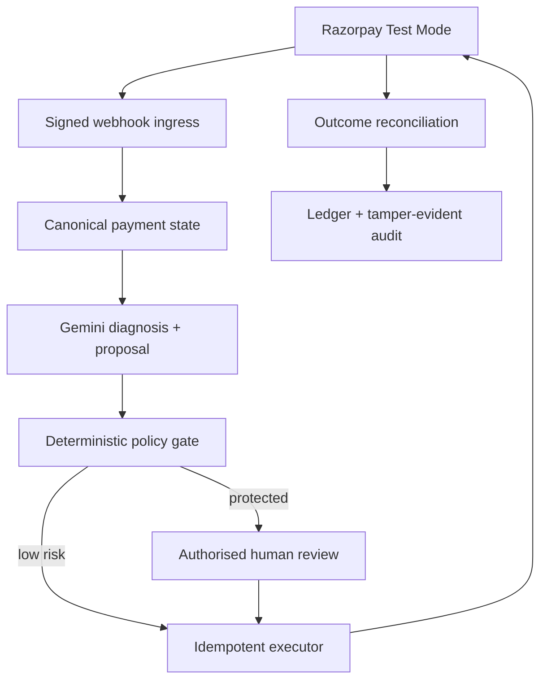

# ReclaimRail

**An evidence-first, policy-bounded payment recovery control plane for Razorpay.**

ReclaimRail turns a provider-confirmed payment failure into a controlled recovery
workflow: Gemini proposes a bounded action, deterministic policy decides whether it is
allowed, an authorised merchant reviews protected high-value actions, and Razorpay
provider evidence proves the financial result.

> AI recommends. Policy and authorised humans decide. Razorpay proves the outcome.

[Demo video](#demo-video) · [Architecture](#architecture) · [Run locally](#local-setup) · [Demo walkthrough](#demo-path)

## Why it exists

A failed payment is not automatically lost revenue, but retrying blindly can create
duplicate collection, customer fatigue, or unsafe actions during an incident.
ReclaimRail provides one auditable workflow for deciding **whether**, **when**, and
**how** recovery may proceed.

## Core capabilities

- Signature-verified Razorpay webhook ingestion and idempotent event processing.
- Live payment-failure workflow backed by Razorpay Test Mode evidence.
- Gemini recovery diagnosis with a deterministic fallback and structured trace.
- Deterministic policy checks for payment state, incident state, retry limits, amount,
  currency, active links, and permitted channels.
- A 24-hour human-review window for protected payment-link actions of ₹10,000 or more.
- Idempotent Razorpay Payment Link execution with bounded retry and 429 backoff.
- Late-authorisation and duplicate-collection protection.
- Provider-confirmed Outcome Ledger: pending links are not counted as revenue.
- Tamper-evident audit chain connecting failure, plan, policy, approval, action, and
  outcome evidence.

## What makes ReclaimRail different

Razorpay already supplies payment primitives. ReclaimRail is the control layer around
those primitives: it decides whether recovery is safe, records why an action was
allowed, and refuses to count revenue until Razorpay confirms the payment.

| Concern | ReclaimRail response |
|---|---|
| AI can be uncertain | Gemini proposes only a schema-constrained action; deterministic fallback keeps the workflow available |
| A retry may duplicate collection | Current provider state, active links and prior attempts are checked before execution |
| High-value actions need accountability | Payment-link actions at or above ₹10,000 enter a time-limited human approval gate |
| Provider incidents make retries unsafe | Incident checks and circuit breakers can defer automated intervention |
| A link is not revenue | The Outcome Ledger remains pending until signed Razorpay evidence confirms payment |
| Decisions must be explainable | Evidence references, policy checks, approvals, provider actions and outcomes form one audit chain |

## Architecture



PostgreSQL is the source of truth. Redis carries temporary background work. The
Next.js operations UI reads the same persisted records used by the FastAPI control
plane and workers.

### Runtime responsibilities

| Layer | Responsibility |
|---|---|
| Next.js operations console | Live demo, command centre, cases, approvals, ledger, policy explanation and evidence inspection |
| FastAPI control plane | Authenticated APIs, webhook ingress, validation and orchestration boundaries |
| PostgreSQL | Authoritative payments, cases, plans, approvals, actions, outcomes and audit events |
| Redis Streams | Durable-work hand-off, consumer groups, retry scheduling and worker coordination |
| Recovery workers | Projection, detection, planning, execution, messaging, compensation and reconciliation |
| Razorpay Test Mode | Payment orders, hosted recovery links and signed financial outcome evidence |
| Gemini | Structured diagnosis and recommendation only; it has no provider credentials or execution authority |

Detailed trust boundaries and failure handling are documented in
[`docs/architecture.md`](docs/architecture.md).

## Product surfaces

| Page | What a judge can verify |
|---|---|
| **Live demo** | One real Razorpay Test Mode failure moving through the controlled workflow |
| **Command center** | Open recovery workload, value under control, confirmed recovery and worker health |
| **Recovery cases** | Case lifecycle, AI trace, policy receipt, provider action and outcome evidence |
| **Human reviews** | Protected high-value decisions with an operator reason and expiry boundary |
| **Outcome ledger** | Pending provider actions separated from provider-confirmed recovered value |
| **Safety controls** | Executable policy contract, enforcement point, reason and stored proof for each rule |
| **Recovery Brain** | Evidence observed by Gemini, its proposal, deterministic verdict and final authority |
| **Evidence Lab** | Repeatable Test Mode scenarios and the exact evidence expected from each run |

## Technology

- Next.js 16, React 19, TypeScript
- FastAPI, Python 3.11, SQLAlchemy, Alembic
- PostgreSQL and Redis
- Razorpay Test Mode and signed webhooks
- Gemini structured planning with deterministic fallback
- Docker Compose and a tracked Windows PowerShell process controller

## Local setup

Prerequisites: Docker Desktop, Python 3.11, `uv`, Node.js, npm, and a Razorpay Test
Mode account.

Configure backend-only secrets in `apps/api/.env`:

```dotenv
RECLAIMRAIL_DATABASE_URL=postgresql+asyncpg://...
RECLAIMRAIL_REDIS_URL=redis://127.0.0.1:6379/0
RECLAIMRAIL_RAZORPAY_KEY_ID=rzp_test_...
RECLAIMRAIL_RAZORPAY_KEY_SECRET=...
RECLAIMRAIL_RAZORPAY_WEBHOOK_SECRET=...
RECLAIMRAIL_GEMINI_API_KEY=...
RECLAIMRAIL_RESEND_API_KEY=...
RECLAIMRAIL_PAYMENT_LAB_DEMO_EMAIL_RECIPIENT=your-allowlisted-test-address
RECLAIMRAIL_RECOVERY_APPROVAL_THRESHOLD_MINOR=1000000
RECLAIMRAIL_RECOVERY_APPROVAL_TTL_SECONDS=86400
RECLAIMRAIL_RECOVERY_OPERATOR_ACCESS_TOKEN=...
RECLAIMRAIL_PAYMENT_LAB_ACCESS_TOKEN=...
```

`RECLAIMRAIL_RESEND_API_KEY` and the demo recipient are optional and used only for the controlled
recovery-email demonstration. The sample values above are names, never real secrets.

Configure the frontend server bridge in `apps/web/.env.local`. Keep its operator token
equal to the backend value; never expose any provider secret to browser code.

Start or restart the complete local control plane from Windows PowerShell:

```powershell
.\scripts\ReclaimRail-Local.ps1 -Restart
```

Open `http://127.0.0.1:3000`. The controller starts PostgreSQL, Redis, FastAPI,
webhook ingress, the recovery workers, and Next.js, applies migrations, and waits for
health checks.

For signed Razorpay webhooks, expose port `8001` through a tunnel and configure this
Test Mode endpoint in Razorpay:

```text
https://<current-tunnel-host>/webhooks/razorpay
```

Enable the Test Mode events used by the demonstration:

- `payment.failed`
- `payment.authorized`
- `payment.captured`
- `payment_link.paid`

The tunnel URL is temporary. If it changes, update only the webhook URL in the
Razorpay Test Mode dashboard; API keys and source code do not need to change.

## Demo path

1. Start a Razorpay Test Mode payment from **Live demo**.
2. Produce a provider-recorded failed payment.
3. Watch ReclaimRail open the recovery case and persist the AI recommendation.
4. For an amount of ₹10,000 or more, open **Human reviews**, record a reason, and
   approve or reject the exact protected action.
5. On approval, inspect the real hosted Razorpay Test Payment Link under
   **Recovery cases**.
6. Complete the test payment and verify that the signed provider result updates the
   **Command center** and **Outcome ledger**.

### Two paths worth showing

- **₹3,499 low-value path:** policy permits the bounded recovery action without human
  approval; the case closes only after the recovery link is paid and reconciled.
- **₹12,312 protected path:** policy pauses execution, an authorised operator records
  approval, and only then may the exact payment link be created.

Both paths were exercised end to end in Razorpay Test Mode during final verification.
This is functional test evidence, not a claim that real money moved.

For a deterministic recorded walkthrough, use one case at a time. Razorpay may return
HTTP 429 when a Test Mode account exceeds its provider request quota; ReclaimRail
records that truth and backs off instead of fabricating a link or financial outcome.

## Safety invariants

- Invalid or duplicate webhooks cannot repeat a state transition.
- Gemini cannot execute provider actions or override deterministic policy.
- Amount and currency are immutable throughout recovery.
- Rejected or expired approvals execute no provider action.
- An authorised, captured, or already-recovered payment cannot receive another link.
- A created link is pending value, never recovered revenue.
- Only provider-confirmed payment evidence changes recovered revenue.

## Verification

```powershell
cd apps\api
uv run pytest
uv run ruff check app tests

cd ..\web
npm run lint
npm run build
```

The final frontend production build completes successfully with TypeScript validation
and route generation. Run the complete backend suite locally before release because
provider credentials and Docker-backed integration state remain environment-specific.

## Repository structure

```text
ReclaimRail/
├── apps/api/                 FastAPI control plane, domain logic and workers
│   ├── app/api/              HTTP and webhook routes
│   ├── app/domain/           Payment, incident and recovery policy models
│   ├── app/integrations/     Razorpay, Gemini and notification adapters
│   ├── app/services/         Recovery orchestration and reconciliation
│   ├── app/workers/          Independently supervised background workers
│   ├── migrations/           Alembic schema history
│   └── tests/                Unit and integration coverage
├── apps/web/                 Next.js operations console
├── docs/                     Architecture, contracts, decisions and operations
├── ops/                      Local process manifest
├── scripts/                  Windows control-plane launcher
└── docker-compose.yml        PostgreSQL and Redis dependencies
```

## Demo video

The submission video should show, in this order:

1. The problem and ReclaimRail control boundary.
2. A provider-recorded failed Test Mode payment.
3. Gemini's evidence-linked proposal and the deterministic policy verdict.
4. The automatic low-value path or protected high-value approval path.
5. The hosted Razorpay recovery link and successful Test Mode payment.
6. The recovered Outcome Ledger entry and tamper-evident case audit chain.

Add the final public/unlisted demo URL here before submission:

```text
Demo: <add-video-link>
```

## Documentation

- [`docs/architecture.md`](docs/architecture.md) — architecture, trust boundaries, and
  end-to-end event flow.
- [`docs/domain-model.md`](docs/domain-model.md) — payment and recovery domain model.
- [`docs/contracts.md`](docs/contracts.md) — webhook, agent, and policy contracts.
- [`docs/operations/local-control-plane.md`](docs/operations/local-control-plane.md) —
  local startup, health, and human-review operations.
- [`docs/decisions/0001-bounded-recovery-agent.md`](docs/decisions/0001-bounded-recovery-agent.md)
  — bounded-agent design decision.

## Test-mode notice

ReclaimRail uses synthetic customer data and Razorpay Test Mode. No real money moves.
Secrets, raw card data, and customer credentials are never sent to Gemini or committed
to the repository.
