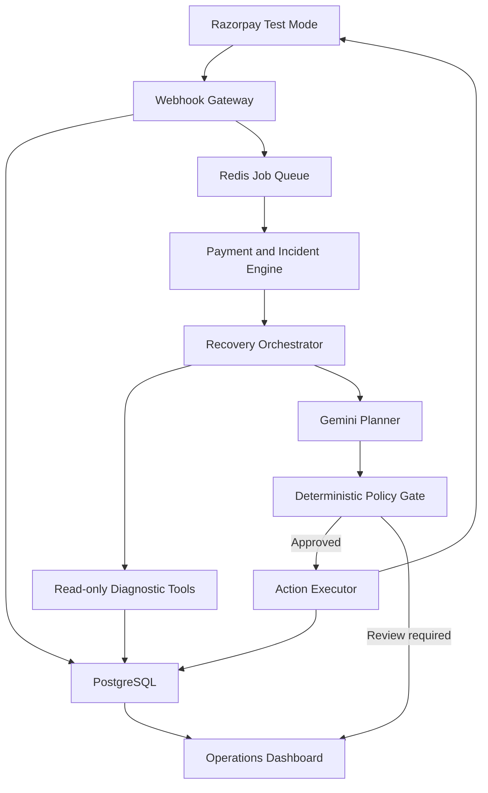
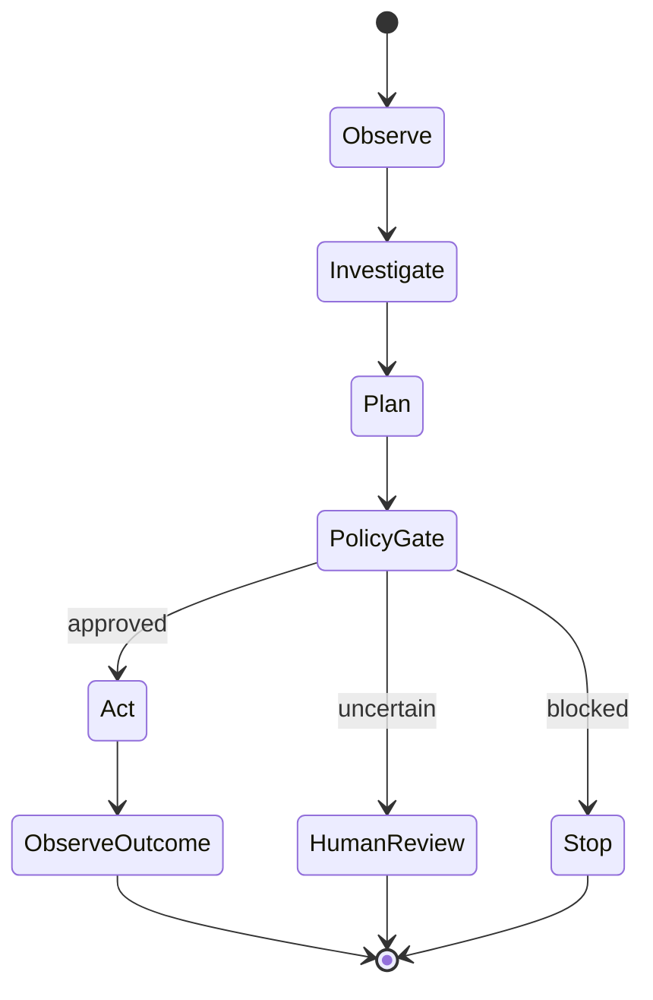

# ReclaimRail System Architecture

## 1. Purpose

ReclaimRail is an incident-aware payment recovery control plane for Razorpay merchants.

It detects revenue at risk, investigates payment failures, proposes a bounded recovery intervention, validates that intervention using deterministic policies, executes approved Razorpay Test Mode actions, and measures the resulting recovered revenue.

The central safety principle is:

> The LLM proposes; verified policy code disposes.

Gemini can investigate and recommend, but it cannot directly change payment state, construct unrestricted actions, or move money.

## 2. System Context

## 3. Core Components

| Component | Responsibility |
|---|---|
| Next.js Operations Dashboard | Displays incidents, recovery cases, evidence, policy decisions, audit history, metrics, Replay Lab and approval workflows |
| FastAPI Control Plane | Provides REST APIs, validates requests and coordinates application services |
| Webhook Gateway | Preserves the raw request, verifies Razorpay signatures, rejects invalid requests and stores valid events idempotently |
| Redis Job Queue | Moves webhook processing, incident detection and recovery work outside the request path |
| Background Worker | Processes queued events, scheduled retries, agent runs and outcome reconciliation |
| Payment State Engine | Maintains the canonical payment lifecycle and handles duplicate, delayed and out-of-order events |
| Incident Detection Engine | Groups failures and detects abnormal provider, payment-method or error-category degradation |
| Recovery Orchestrator | Runs the bounded observe → investigate → plan → gate → act → observe-outcome workflow |
| Diagnostic Tool Layer | Provides the agent with approved read-only access to payment status, retry history, incident health and merchant policy |
| Gemini Planner | Produces one structured diagnosis and one proposed recovery action from an allow-list |
| Deterministic Policy Gate | Validates every proposed action against payment truth, merchant policy and safety rules |
| Action Executor | Performs approved Razorpay Test Mode actions using idempotent execution |
| Outcome Reconciler | Matches later webhooks to recovery attempts and stops recovery after successful or late authorization |
| Recovery Attribution Ledger | Measures at-risk revenue, attempted recovery and confirmed recovered money |
| PostgreSQL | Stores canonical domain state, agent traces, audit records and evaluation results |
| Redis | Supports queues, short-lived locks, scheduling and caching; it is not the source of truth |

## 4. End-to-End Event Flow

1. Razorpay sends a Test Mode webhook to the FastAPI webhook endpoint.
2. The Webhook Gateway reads the raw request body and verifies its HMAC signature.
3. An invalid webhook is rejected before its payload is trusted.
4. A valid webhook is stored using a unique event identity.
5. Duplicate deliveries return safely without repeating state transitions or actions.
6. A lightweight job is placed on Redis, and the webhook request returns promptly.
7. The worker validates and normalises the event into the internal payment-event format.
8. The Payment State Engine applies an allowed state transition.
9. Failure signals are grouped by merchant, provider, payment method and error category.
10. The Incident Detection Engine compares the current failure rate with the merchant-specific baseline.
11. A recovery case is created or updated when revenue is considered recoverable.
12. The Recovery Orchestrator gathers a privacy-safe observation.
13. The agent may call a maximum of four approved read-only diagnostic tools.
14. Gemini returns a schema-valid diagnosis and exactly one proposed action.
15. The deterministic Policy Gate checks current payment status, retry limits, quiet periods, incident state, duplicate links and merchant rules.
16. An approved action is executed with an idempotency key, or the case is routed for human review.
17. Later Razorpay events are reconciled with the recovery case.
18. Successful authorization or capture stops further recovery.
19. The attribution ledger records confirmed recovered revenue.
20. Every decision, policy block, action and outcome is available in the dashboard and audit trail.

## 5. Bounded Recovery Agent

### Observe

The orchestrator creates a compact observation containing verified payment state, failure context, incident summary and merchant-policy identifiers.

### Investigate

The agent may use only these read-only diagnostic tools:

- `get_payment_snapshot`
- `get_retry_history`
- `get_incident_health`
- `get_merchant_policy`

Each run has a maximum of four tool calls, a timeout and a token budget.

### Plan

Gemini must return structured JSON containing:

- Root-cause category
- Recoverability assessment
- Urgency
- Confidence
- Evidence references
- Exactly one allowed action
- Short explanation
- Human-review flag

### Policy Gate

Deterministic code checks the proposal against current system state. Gemini cannot bypass, modify or disable this gate.

### Act

Only an approved action executor may call Razorpay Test Mode APIs.

### Observe Outcome

The system waits for verified webhook outcomes, reconciles the result and updates the recovery-attribution ledger.

## 6. Allowed Recovery Actions

The agent may propose exactly one action:

- `VERIFY_STATUS`
- `WAIT_FOR_INCIDENT_RECOVERY`
- `RETRY_LATER`
- `CREATE_PAYMENT_LINK`
- `SUGGEST_ALTERNATE_METHOD`
- `ESCALATE`
- `STOP`

The agent cannot invent action names, API endpoints, payment amounts, currencies, retry counts or payment-link parameters.

## 7. Trust Boundaries

### Untrusted Inputs

- Incoming webhook payloads before signature verification
- Browser requests
- Gemini responses
- Duplicate or replayed events
- Delayed and out-of-order events

### Trusted After Verification

- Signature-verified and schema-validated webhook events
- Canonical state stored in PostgreSQL
- Deterministic policy results
- Server-side Razorpay status responses
- Idempotently recorded action outcomes

### Protected Secrets

The following values exist only in backend environment variables or deployment secret storage:

- Razorpay Test Key ID
- Razorpay Test Key Secret
- Razorpay webhook secret
- Gemini API key
- Database URL
- Redis URL

Secrets must never appear in the frontend, Gemini prompt, logs, screenshots, README or Git history.

## 8. Safety Invariants

1. Invalid webhook signatures never change system state.
2. The same event never produces more than one state transition.
3. The same recovery action never executes more than once.
4. Payment amount and currency are immutable.
5. Current Razorpay payment status is checked before an external recovery action.
6. Authorized, captured or already-recovered payments cannot receive another recovery link.
7. An active incident can trigger a retry circuit breaker.
8. Retry limits and quiet periods are always enforced.
9. Low-confidence or high-risk cases require human review.
10. Gemini output must pass schema validation and the deterministic Policy Gate.
11. Gemini cannot access API keys or raw customer payment credentials.
12. Every agent run, tool call, proposal, policy decision, action and outcome is auditable.
13. All development and demonstrations use synthetic data and Razorpay Test Mode.

## 9. Failure Handling

| Failure | Safe behaviour |
|---|---|
| Invalid webhook signature | Reject the request and record a security metric without trusting the payload |
| Duplicate webhook | Return safely without repeating processing |
| Out-of-order webhook | Reconcile against the canonical state machine |
| Redis unavailable after durable storage | Keep the event pending for later database-backed recovery |
| Worker crash | Retry the job; idempotency prevents duplicate actions |
| Razorpay API unavailable | Open/update an incident and select `WAIT_FOR_INCIDENT_RECOVERY` |
| Gemini timeout | Use deterministic fallback and route the case for review |
| Invalid Gemini JSON | Reject the plan and route the case for review |
| Policy violation | Block the proposal and record the violated rule |
| Late authorization | Stop recovery and invalidate any unnecessary recovery action |
| Duplicate payment-link request | Return the existing active link or block creation |
| Database unavailable | Do not acknowledge work that cannot be stored durably |

## 10. Data Ownership

PostgreSQL is the source of truth for:

- Webhook events
- Payments
- Payment attempts
- Incidents
- Recovery cases
- Merchant policies
- Agent runs and tool traces
- Recovery plans
- Policy decisions
- Recovery actions
- Human reviews
- Audit records
- Revenue-attribution records
- Evaluation runs

Redis contains temporary operational state only:

- Background jobs
- Scheduled jobs
- Short-lived locks
- Rate limits
- Response cache entries

Loss of Redis must not corrupt canonical payment or recovery state.

## 11. Observability

Every workflow uses correlation identifiers:

- `event_id`
- `payment_id`
- `incident_id`
- `recovery_case_id`
- `agent_run_id`
- `action_id`

The system records structured logs and metrics for:

- Webhook signature rejection
- Duplicate-event suppression
- Processing latency
- Incident detection
- Agent latency and tool usage
- Gemini validation failures
- Policy blocks
- Recovery actions
- Human-review decisions
- Confirmed recovered amount
- Duplicate-payment prevention

## 12. Runtime Topology

Local development uses Docker Compose with:

- `web`: Next.js frontend
- `api`: FastAPI backend
- `worker`: background recovery worker
- `postgres`: canonical database
- `redis`: queue and cache

The public demo uses separately deployed frontend, backend, database and Redis services. Provider selection is deferred until the deployment phase, but the application must remain portable through environment-based configuration and containerisation.

## 13. Architectural Boundaries

- The frontend never calls Razorpay or Gemini using secret credentials.
- The API never performs slow agent work inside the webhook request.
- The worker never bypasses domain services or policy checks.
- Gemini never writes directly to the database.
- Redis never becomes the canonical source of payment truth.
- The action executor never trusts stale recovery-case state.
- Dashboard approval never bypasses current-status and safety revalidation.

## 14. Architectural Success Criteria

The architecture is successful when it can demonstrate:

1. A signature-verified Razorpay Test Mode event entering the system.
2. Duplicate and out-of-order events handled safely.
3. A payment degradation incident detected across a batch.
4. A bounded agent gathering evidence and returning a structured plan.
5. An unsafe recommendation blocked by deterministic policy.
6. A safe Test Mode recovery action executed exactly once.
7. Late authorization stopping unnecessary recovery.
8. Confirmed recovered money measured in the attribution ledger.
9. Every step visible through an auditable dashboard trace.