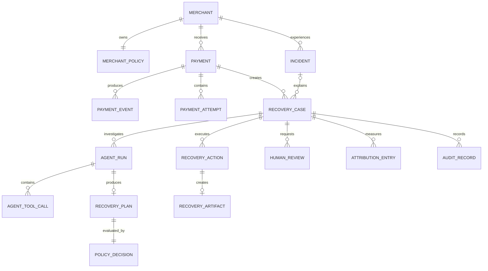
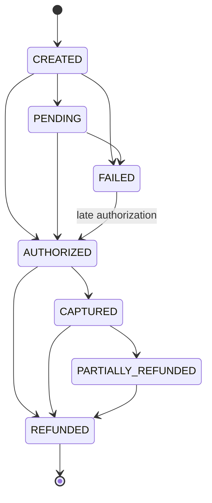
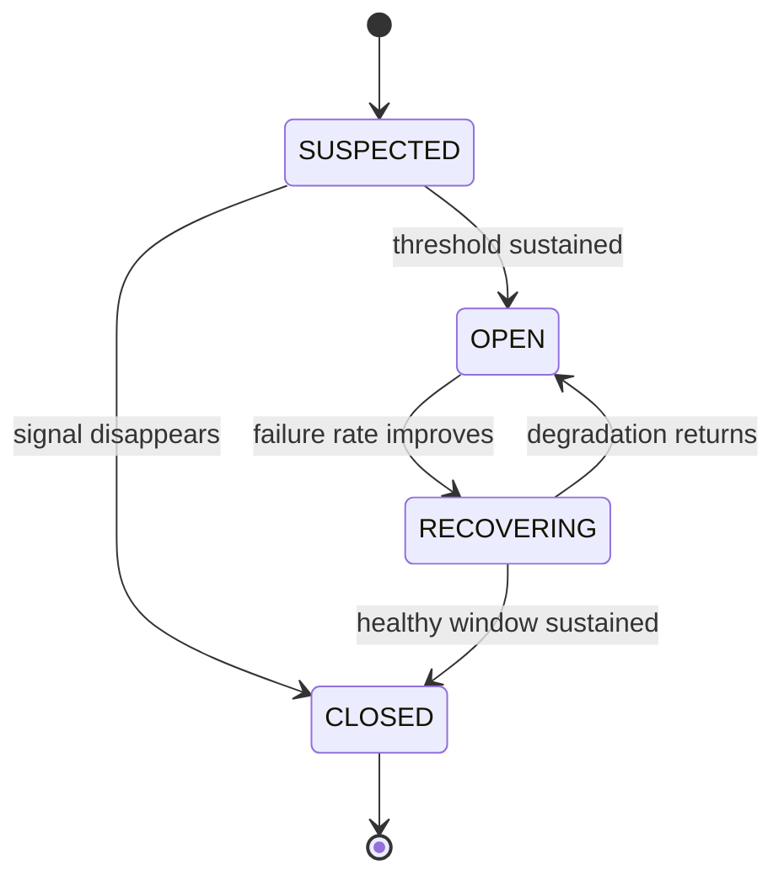
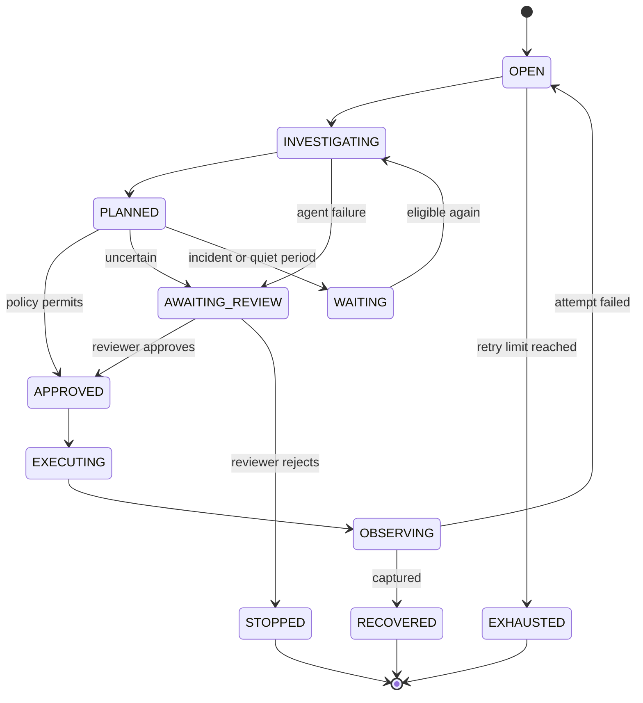

# ReclaimRail Domain Model

## 1. Purpose

This document defines ReclaimRail’s canonical business entities, lifecycle states, relationships and safety constraints.

The domain model separates:

- Payment truth
- Provider incidents
- Recovery investigation
- AI recommendations
- Deterministic policy decisions
- Recovery actions
- Human reviews
- Revenue attribution
- Audit history

PostgreSQL is the canonical source of truth. Redis and Gemini never own canonical payment state.

## 2. Modelling Conventions

- Internal primary keys use UUIDs.
- Monetary amounts use integer paise, never floating-point values.
- Currency uses uppercase ISO codes such as `INR`.
- All timestamps are stored in UTC.
- Razorpay identifiers are stored as external references.
- Customer identifiers are synthetic or hashed.
- Mutable entities use an integer `version` for optimistic locking.
- Enum values use uppercase snake case.
- Terminal states cannot transition back to active states.
- Raw verified webhook events are preserved for replay and debugging.

## 3. Entity Relationships

## 4. Core Entities

### 4.1 Merchant

Represents a Razorpay merchant using ReclaimRail.

| Field | Type | Rules |
|---|---|---|
| `id` | UUID | Primary key |
| `external_reference` | String | Unique synthetic merchant reference |
| `display_name` | String | Merchant-facing name |
| `timezone` | String | Defaults to `Asia/Kolkata` |
| `status` | Enum | `ACTIVE` or `SUSPENDED` |
| `created_at` | Timestamp | UTC |
| `updated_at` | Timestamp | UTC |

### 4.2 MerchantPolicy

Defines deterministic recovery rules for a merchant.

| Field | Type | Rules |
|---|---|---|
| `id` | UUID | Primary key |
| `merchant_id` | UUID | Unique foreign key |
| `version` | Integer | Increments after every policy update |
| `max_retries` | Integer | Range `0–5` |
| `quiet_period_minutes` | Integer | Must be positive |
| `incident_circuit_breaker_enabled` | Boolean | Defaults to `true` |
| `human_review_below_confidence` | Decimal | Range `0.0–1.0` |
| `max_recovery_amount_paise` | Integer | Amount above this requires review |
| `allowed_actions` | Array/JSON | Subset of the global action allow-list |
| `active_from` | Timestamp | Policy effective time |
| `created_at` | Timestamp | UTC |
| `updated_at` | Timestamp | UTC |

A policy version is copied into every policy decision so past decisions remain reproducible.

### 4.3 Payment

Represents the latest canonical state of one Razorpay payment.

| Field | Type | Rules |
|---|---|---|
| `id` | UUID | Primary key |
| `merchant_id` | UUID | Foreign key |
| `razorpay_payment_id` | String | Unique per merchant when available |
| `razorpay_order_id` | String | Optional external order reference |
| `amount_paise` | Integer | Positive and immutable |
| `currency` | String | Immutable; normally `INR` |
| `status` | PaymentStatus | Canonical internal status |
| `method` | String | Card, UPI, netbanking or wallet |
| `provider` | String | Normalised provider/rail |
| `error_code` | String | Optional raw failure code |
| `error_category` | ErrorCategory | Normalised category |
| `customer_reference_hash` | String | Never store unnecessary plaintext PII |
| `occurred_at` | Timestamp | Provider event time |
| `authorized_at` | Timestamp | Optional |
| `captured_at` | Timestamp | Optional |
| `failed_at` | Timestamp | Optional |
| `version` | Integer | Optimistic-lock version |
| `created_at` | Timestamp | UTC |
| `updated_at` | Timestamp | UTC |

Payment amount and currency cannot be changed after creation.

### 4.4 PaymentEvent

Stores one verified external event before and after processing.

| Field | Type | Rules |
|---|---|---|
| `id` | UUID | Primary key |
| `merchant_id` | UUID | Foreign key |
| `payment_id` | UUID | Optional until payment resolution |
| `deduplication_key` | String | Unique per merchant |
| `event_type` | String | Normalised Razorpay event name |
| `payload_hash` | String | SHA-256 of the raw body |
| `raw_payload` | JSON/JSONB | Preserved Test Mode event |
| `signature_verified` | Boolean | Must be `true` before processing |
| `provider_created_at` | Timestamp | When available |
| `received_at` | Timestamp | UTC |
| `processing_status` | EventProcessingStatus | Current processing state |
| `processed_at` | Timestamp | Optional |
| `failure_reason` | String | Optional safe diagnostic text |

The deduplication key uses a provider event identifier when available and a stable payload-derived fallback otherwise.

### 4.5 PaymentAttempt

Represents the original attempt or a subsequent recovery attempt.

| Field | Type | Rules |
|---|---|---|
| `id` | UUID | Primary key |
| `payment_id` | UUID | Foreign key |
| `attempt_number` | Integer | Starts at one |
| `attempt_type` | Enum | `ORIGINAL`, `RETRY`, `PAYMENT_LINK` |
| `external_reference` | String | Optional Razorpay reference |
| `method` | String | Payment method |
| `provider` | String | Normalised provider |
| `status` | Enum | `STARTED`, `SUCCEEDED`, `FAILED`, `CANCELLED` |
| `error_category` | ErrorCategory | Optional |
| `started_at` | Timestamp | UTC |
| `completed_at` | Timestamp | Optional |

The pair `(payment_id, attempt_number)` must be unique.

## 5. Payment State Machine

### PaymentStatus

- `CREATED`
- `PENDING`
- `AUTHORIZED`
- `CAPTURED`
- `FAILED`
- `PARTIALLY_REFUNDED`
- `REFUNDED`

### State-machine rules

1. Duplicate events do not repeat transitions.
2. Older events cannot regress canonical state.
3. `FAILED → AUTHORIZED` is permitted only as a late-authorization transition.
4. `AUTHORIZED` or `CAPTURED` immediately stops active recovery.
5. `CAPTURED` is required before revenue is counted as confirmed recovered.
6. Refunds reduce or reverse attributed recovered revenue.
7. Invalid transitions are recorded but never applied silently.

## 6. Incident

Represents abnormal payment degradation affecting a group of payments.

| Field | Type | Rules |
|---|---|---|
| `id` | UUID | Primary key |
| `merchant_id` | UUID | Foreign key |
| `group_key` | String | Hash of the incident dimensions |
| `payment_method` | String | Optional grouping dimension |
| `provider` | String | Optional grouping dimension |
| `error_category` | ErrorCategory | Optional grouping dimension |
| `status` | IncidentStatus | Lifecycle state |
| `severity` | IncidentSeverity | `LOW`, `MEDIUM`, `HIGH`, `CRITICAL` |
| `baseline_failure_rate` | Decimal | Historical merchant baseline |
| `observed_failure_rate` | Decimal | Current failure rate |
| `robust_deviation_score` | Decimal | Statistical anomaly score |
| `failure_count` | Integer | Failures in the active window |
| `sample_count` | Integer | Total attempts in the active window |
| `detected_at` | Timestamp | UTC |
| `started_at` | Timestamp | Estimated start |
| `recovering_at` | Timestamp | Optional |
| `closed_at` | Timestamp | Optional |
| `version` | Integer | Optimistic-lock version |

## 7. Incident Lifecycle

### Incident rules

- A single spike does not immediately open an incident.
- Opening and closing require sustained evidence across configured windows.
- Active incidents can block retries for matching payment groups.
- A closed incident is not reopened; a later degradation creates a new incident.
- Every threshold and baseline value is stored for reproducibility.

## 8. RecoveryCase

Represents the complete recovery lifecycle for one failed payment.

| Field | Type | Rules |
|---|---|---|
| `id` | UUID | Primary key |
| `merchant_id` | UUID | Foreign key |
| `payment_id` | UUID | Foreign key |
| `incident_id` | UUID | Optional foreign key |
| `status` | RecoveryCaseStatus | Lifecycle state |
| `at_risk_amount_paise` | Integer | Copied from immutable payment amount |
| `priority_score` | Decimal | Deterministic prioritisation score |
| `recoverability` | Enum | `LOW`, `MEDIUM`, `HIGH`, `UNKNOWN` |
| `retry_count` | Integer | Completed recovery attempts |
| `next_action_at` | Timestamp | Optional scheduled execution |
| `stop_reason` | String | Required for a stopped case |
| `opened_at` | Timestamp | UTC |
| `resolved_at` | Timestamp | Optional |
| `version` | Integer | Optimistic-lock version |
| `created_at` | Timestamp | UTC |
| `updated_at` | Timestamp | UTC |

Only one non-terminal recovery case may exist for a payment at a time.

## 9. Recovery-Case Lifecycle

Any non-terminal case may transition to `STOPPED` when:

- The payment authorizes or captures outside the recovery action
- Current status makes recovery unsafe
- The merchant disables recovery
- The amount or currency cannot be reconciled
- A duplicate-payment risk is detected

## 10. Agent Entities

### 10.1 AgentRun

Represents one bounded agent investigation.

| Field | Type | Rules |
|---|---|---|
| `id` | UUID | Primary key |
| `recovery_case_id` | UUID | Foreign key |
| `status` | AgentRunStatus | Lifecycle state |
| `model_name` | String | Exact Gemini model identifier |
| `prompt_version` | String | Versioned prompt reference |
| `input_snapshot` | JSONB | Privacy-safe verified context |
| `tool_call_count` | Integer | Maximum four |
| `token_usage` | JSONB | Input/output usage |
| `latency_ms` | Integer | Total runtime |
| `fallback_used` | Boolean | Whether deterministic fallback ran |
| `error_code` | String | Optional |
| `started_at` | Timestamp | UTC |
| `completed_at` | Timestamp | Optional |

### 10.2 AgentToolCall

Stores each diagnostic step.

| Field | Type | Rules |
|---|---|---|
| `id` | UUID | Primary key |
| `agent_run_id` | UUID | Foreign key |
| `sequence_number` | Integer | Range `1–4` |
| `tool_name` | String | Must be from the read-only allow-list |
| `arguments` | JSONB | Schema-validated |
| `result_reference` | JSONB | Minimal returned evidence |
| `latency_ms` | Integer | Tool runtime |
| `status` | Enum | `SUCCEEDED`, `FAILED`, `TIMED_OUT` |
| `created_at` | Timestamp | UTC |

The pair `(agent_run_id, sequence_number)` must be unique.

### 10.3 RecoveryPlan

Stores Gemini’s schema-validated recommendation.

| Field | Type | Rules |
|---|---|---|
| `id` | UUID | Primary key |
| `agent_run_id` | UUID | Unique foreign key |
| `root_cause_category` | String | From a controlled taxonomy |
| `recoverability` | Enum | `LOW`, `MEDIUM`, `HIGH`, `UNKNOWN` |
| `urgency` | Enum | `LOW`, `MEDIUM`, `HIGH` |
| `confidence` | Decimal | Range `0.0–1.0` |
| `evidence` | JSONB | References to verified tool evidence |
| `proposed_action` | RecoveryActionType | Exactly one allowed action |
| `explanation` | String | Short, bounded length |
| `requires_human_review` | Boolean | Agent uncertainty signal |
| `schema_version` | String | Structured-output schema version |
| `created_at` | Timestamp | UTC |

## 11. PolicyDecision

Records the deterministic evaluation of a recovery plan.

| Field | Type | Rules |
|---|---|---|
| `id` | UUID | Primary key |
| `recovery_plan_id` | UUID | Unique foreign key |
| `merchant_policy_id` | UUID | Foreign key |
| `policy_version` | Integer | Version used for evaluation |
| `decision` | Enum | `PERMITTED`, `BLOCKED`, `REVIEW_REQUIRED`, `DEFERRED` |
| `violated_rules` | JSONB | Stable rule identifiers |
| `approved_action` | RecoveryActionType | Optional |
| `safe_parameters` | JSONB | Constructed by deterministic code |
| `evaluated_at` | Timestamp | UTC |

Gemini-provided action parameters are never forwarded directly to the executor.

## 12. RecoveryAction

Represents one policy-approved recovery operation.

| Field | Type | Rules |
|---|---|---|
| `id` | UUID | Primary key |
| `recovery_case_id` | UUID | Foreign key |
| `policy_decision_id` | UUID | Foreign key |
| `action_type` | RecoveryActionType | Approved action |
| `status` | RecoveryActionStatus | Lifecycle state |
| `idempotency_key` | String | Globally unique |
| `safe_parameters` | JSONB | Generated by deterministic code |
| `external_reference` | String | Optional Razorpay Test Mode reference |
| `scheduled_at` | Timestamp | Optional |
| `started_at` | Timestamp | Optional |
| `completed_at` | Timestamp | Optional |
| `failure_code` | String | Optional |
| `created_at` | Timestamp | UTC |

### RecoveryActionStatus

- `QUEUED`
- `EXECUTING`
- `SUCCEEDED`
- `FAILED`
- `CANCELLED`
- `EXPIRED`

## 13. RecoveryArtifact

Represents an external artifact created by a recovery action.

| Field | Type | Rules |
|---|---|---|
| `id` | UUID | Primary key |
| `payment_id` | UUID | Foreign key |
| `recovery_action_id` | UUID | Unique foreign key |
| `artifact_type` | Enum | Initially `PAYMENT_LINK` |
| `external_reference` | String | Razorpay Test Mode reference |
| `status` | Enum | `ACTIVE`, `USED`, `CANCELLED`, `EXPIRED` |
| `expires_at` | Timestamp | Optional |
| `created_at` | Timestamp | UTC |
| `updated_at` | Timestamp | UTC |

A partial unique constraint permits only one `ACTIVE` payment-link artifact per payment.

## 14. HumanReview

Represents a merchant-operations approval decision.

| Field | Type | Rules |
|---|---|---|
| `id` | UUID | Primary key |
| `recovery_case_id` | UUID | Foreign key |
| `requested_reason` | String | Required |
| `status` | Enum | `PENDING`, `APPROVED`, `REJECTED`, `EXPIRED` |
| `reviewer_reference` | String | Synthetic reviewer identifier |
| `comment` | String | Optional |
| `requested_at` | Timestamp | UTC |
| `decided_at` | Timestamp | Optional |

Human approval does not bypass current-status or policy revalidation.

## 15. AttributionEntry

Records measurable revenue outcomes.

| Field | Type | Rules |
|---|---|---|
| `id` | UUID | Primary key |
| `recovery_case_id` | UUID | Foreign key |
| `recovery_action_id` | UUID | Optional foreign key |
| `entry_type` | Enum | `AT_RISK`, `RECOVERED`, `REVERSAL` |
| `amount_paise` | Integer | Positive |
| `currency` | String | Matches the payment |
| `evidence_event_id` | UUID | Verified event supporting the entry |
| `attribution_window` | String | Versioned evaluation rule |
| `recorded_at` | Timestamp | UTC |

### Attribution rules

- `AT_RISK` is recorded once per recovery case.
- `RECOVERED` is recorded only after verified capture.
- A refund creates a `REVERSAL`; historical records are not deleted.
- The same payment cannot be counted twice in batch results.
- Baseline and ReclaimRail evaluation use the same seeded payment batch.

## 16. AuditRecord

Represents an append-only audit event.

| Field | Type | Rules |
|---|---|---|
| `id` | UUID | Primary key |
| `recovery_case_id` | UUID | Foreign key |
| `actor_type` | Enum | `SYSTEM`, `AGENT`, `POLICY`, `HUMAN`, `RAZORPAY` |
| `actor_reference` | String | Safe identifier |
| `event_type` | String | Stable audit-event name |
| `entity_type` | String | Affected entity |
| `entity_id` | UUID | Affected entity identifier |
| `summary` | String | Human-readable explanation |
| `details` | JSONB | Redacted structured details |
| `correlation_id` | String | Workflow correlation identifier |
| `occurred_at` | Timestamp | UTC |

Audit records are append-only and cannot contain secrets or raw sensitive credentials.

## 17. Shared Enums

### EventProcessingStatus

- `RECEIVED`
- `PROCESSING`
- `PROCESSED`
- `DUPLICATE`
- `FAILED`
- `DEAD_LETTER`

### IncidentStatus

- `SUSPECTED`
- `OPEN`
- `RECOVERING`
- `CLOSED`

### RecoveryCaseStatus

- `OPEN`
- `INVESTIGATING`
- `PLANNED`
- `AWAITING_REVIEW`
- `WAITING`
- `APPROVED`
- `EXECUTING`
- `OBSERVING`
- `RECOVERED`
- `EXHAUSTED`
- `STOPPED`

### AgentRunStatus

- `RUNNING`
- `SUCCEEDED`
- `FAILED`
- `TIMED_OUT`
- `FALLBACK`

### RecoveryActionType

- `VERIFY_STATUS`
- `WAIT_FOR_INCIDENT_RECOVERY`
- `RETRY_LATER`
- `CREATE_PAYMENT_LINK`
- `SUGGEST_ALTERNATE_METHOD`
- `ESCALATE`
- `STOP`

### ErrorCategory

- `INSUFFICIENT_FUNDS`
- `AUTHENTICATION_FAILED`
- `CUSTOMER_CANCELLED`
- `BANK_DECLINED`
- `PROVIDER_UNAVAILABLE`
- `NETWORK_ERROR`
- `TIMEOUT`
- `RISK_DECLINED`
- `INVALID_REQUEST`
- `UNKNOWN`

## 18. Required Database Constraints

1. Unique payment reference per merchant.
2. Unique webhook deduplication key per merchant.
3. Unique `(payment_id, attempt_number)`.
4. Unique `(agent_run_id, sequence_number)`.
5. Unique action idempotency key.
6. Only one non-terminal recovery case per payment.
7. Only one active payment-link artifact per payment.
8. Positive amounts and non-empty currencies.
9. Confidence values constrained to `0.0–1.0`.
10. Maximum four diagnostic tool calls per agent run.
11. Required stop reason for stopped recovery cases.
12. Recovery attribution requires a verified evidence event.
13. Audit records cannot be updated or deleted by application services.

## 19. Domain Success Criteria

The model must support these cases without ambiguity:

1. Duplicate webhook delivery
2. Failed payment followed by late authorization
3. Out-of-order payment events
4. Provider-wide payment degradation
5. Recovery delayed by an active incident
6. Gemini returning an unsafe recommendation
7. Human approval followed by current-status revalidation
8. Duplicate payment-link prevention
9. Worker retry without duplicate external action
10. Captured recovery followed by a refund reversal
11. Gemini timeout with deterministic fallback
12. Measured recovery across a seeded batch