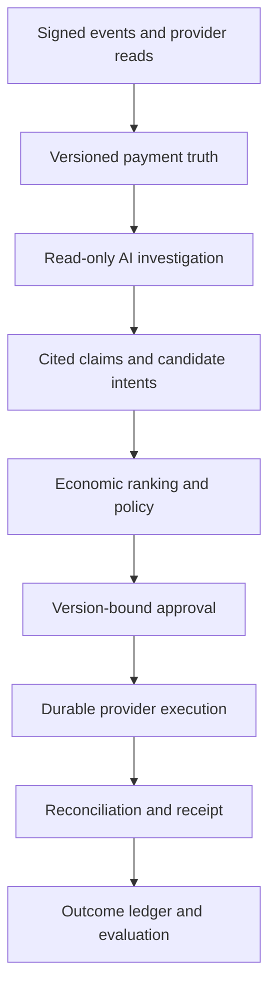
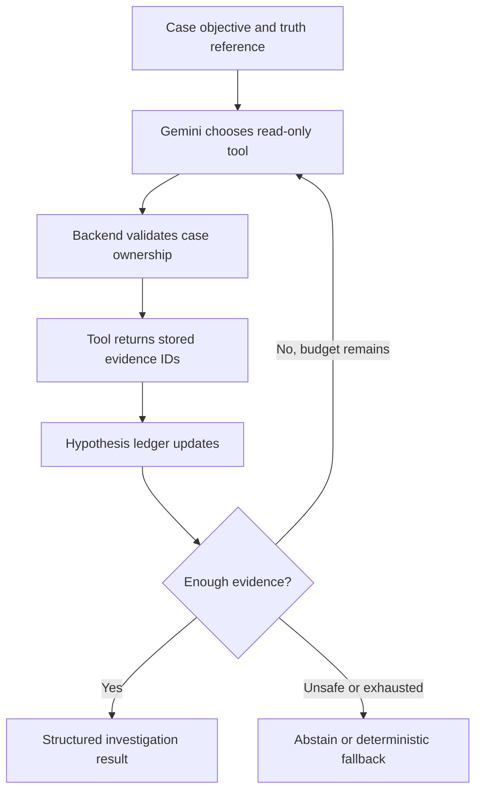

# ReclaimRail Master Execution Plan

> **Authority:** This is the implementation source of truth for ReclaimRail
> Phases 14–23. It converts the product roadmap into requirements that can be
> implemented, tested and audited. A phase is not complete because code exists;
> every mandatory requirement must have runtime evidence and verification evidence.

- **Plan version:** 1.0
- **Locked on:** 23 September 2026
- **Product:** Evidence-grounded, policy-bounded payment recovery control plane
- **Current merged baseline:** `67c950c` (Phases 15 and 16 merged through PR #17)
- **Current phase:** Phase 17 — Gemini Evidence Investigator
- **Completed phases:** 1–16
- **Pending phases:** 17–23

## 1. Why this document exists

This document prevents four recurring failures:

1. forgetting requirements agreed earlier;
2. implementing only the visible UI while backend proof is missing;
3. calling scaffolding or unit tests a completed production path; and
4. adding attractive features that weaken the payment-safety thesis.

Every implementation session must begin by reading:

1. `docs/INVARIANTS.md`;
2. this document;
3. the current phase section in this document;
4. the current phase-specific document; and
5. the latest merged build log and open pull-request diff.

If chat instructions conflict with a safety invariant, the invariant wins. If a
new product decision changes this plan, update this file in the same pull request
as the implementation. Never silently omit or redefine an agreed requirement.

## 2. Product thesis and proof standard

ReclaimRail does not treat an AI response, browser callback, network error or
message-provider acceptance as financial truth. It:

1. establishes versioned payment truth from stored evidence;
2. lets an AI investigator gather bounded, read-only evidence and abstain;
3. validates every AI claim against cited evidence;
4. ranks safe recovery alternatives;
5. lets deterministic policy and version-bound approval authorize an action;
6. records durable intent before any provider mutation;
7. reconciles ambiguous outcomes before retrying; and
8. produces an auditable, tamper-evident decision and outcome receipt.

The product must prove three different outcomes separately:

| Outcome | Meaning | Required proof |
| --- | --- | --- |
| Action success | ReclaimRail executed an allowed action | durable attempt and provider acknowledgement |
| Payment success | Razorpay confirms a payment state | provider API or verified signed webhook evidence |
| Attributed recovery | The action caused a verified recovery payment | verified payment plus action/case attribution |

Test Mode, replay and synthetic results must always remain visibly distinct.

## 3. Authority boundaries

### 3.1 Components allowed to decide

| Concern | Authority |
| --- | --- |
| Payment chronology and truth | deterministic truth resolver |
| Evidence ownership and freshness | backend validation |
| Hypothesis generation | Gemini investigator |
| Tool selection | Gemini within a read-only allow-list |
| Claim validity | deterministic claim validator |
| Candidate-action feasibility | deterministic capability filter |
| Candidate ranking | bounded economic ranker |
| Permission to act | deterministic policy engine |
| Protected exception | version-bound human approval |
| Amount, customer, provider resource | trusted backend resolution |
| Financial outcome | provider verification and reconciliation |

### 3.2 AI may never

- declare payment truth;
- change payment state directly;
- choose or modify the amount;
- invent customer contact details or provider IDs;
- bypass policy, approval, cooldowns or retry budgets;
- call a provider-changing tool during investigation;
- cite evidence from a different case or from the future;
- convert low confidence into permission;
- report simulated recovery as real revenue; or
- expose private chain-of-thought.

The UI may show structured hypotheses, cited claims, tool calls, alternative
actions and closed reason codes. It must not claim to show hidden model reasoning.

## 4. Non-negotiable system invariants

The detailed contract remains in `docs/INVARIANTS.md`. The delivery-critical
summary is:

1. `UNKNOWN` never means `FAILED`.
2. Only verified, case-owned evidence may establish payment truth.
3. Every truth snapshot is immutable and versioned.
4. New material evidence invalidates stale plans, approvals and executable work.
5. Every AI claim cites stored evidence available at decision time.
6. AI emits only a coordinate-free intent; the backend resolves trusted values.
7. No Razorpay-changing call occurs without committed durable intent.
8. Provider ambiguity becomes `IN_FLIGHT` or reconciliation-required, not blind retry.
9. Every mutation is idempotent and reconciliation precedes retry.
10. Money is integer minor units with an explicit currency.
11. Provider-confirmed outcomes are distinct from application/action success.
12. Recovery notifications require capability, consent and policy permission.
13. Test Mode, replay and synthetic evidence are never combined into production claims.
14. Missing metrics remain unavailable; they never become invented zeroes.
15. All high-impact decisions retain model, prompt, tool, evidence and policy versions.

## 5. Delivery workflow that must be followed

### 5.1 Start-of-phase gate

Before writing phase code:

- [ ] `main` is clean and synchronized with `origin/main`.
- [ ] Previous phase pull request is merged and its final CI is green.
- [ ] Previous phase status and verification evidence are recorded here.
- [ ] A dedicated branch is created from the verified baseline.
- [ ] Mandatory requirement IDs for the phase are copied into the PR description.
- [ ] Existing behavior that must remain compatible is identified.

Branch format: `phase-<number>/<short-scope>`.

### 5.2 Implementation order inside every phase

1. contracts and invalid states;
2. persistence and migration, if required;
3. deterministic domain behavior;
4. services and provider adapters;
5. worker/API wiring;
6. negative, race and failure tests;
7. reviewer-facing proof;
8. documentation and build log;
9. full backend/frontend/repository gate.

### 5.3 Definition of done

A mandatory requirement can be marked complete only when all applicable columns
are filled:

| Requirement | Contract | Runtime path | Persistence | Failure behavior | Automated test | Reviewer proof |
| --- | --- | --- | --- | --- | --- | --- |
| Example | schema/enum | service/worker/API | table/record | fail-closed result | test name | API/UI/receipt |

Not sufficient by itself:

- file creation;
- mocked happy-path test;
- UI text;
- a model returning JSON once;
- a screenshot;
- provider API acceptance without reconciliation;
- a passing focused test while the full suite fails.

### 5.4 Change-control rule

Requirements use stable IDs. They may be:

- **completed** — runtime and proof gates passed;
- **pending** — not implemented;
- **blocked** — external dependency documented with safe fallback;
- **deferred** — explicitly moved without being called complete; or
- **replaced** — superseding requirement and reason recorded.

No requirement may disappear from this file. New work must identify whether it is
mandatory, important or stretch. Stretch work cannot delay the mandatory path.

## 6. Locked end-to-end workflow



Every arrow must correspond to persisted or reproducible evidence. A frontend
animation may visualize the workflow but may not create a stage or timestamp.

## 7. Phase status ledger

| Phase | Scope | Status | Merge/build evidence |
| --- | --- | --- | --- |
| 14 | Safety invariants and contracts | **Complete** | PR #15 lineage; typed contracts, ADRs and invariant tests |
| 15 | Versioned Payment Truth Resolver | **Complete** | PR #16 plus Phase 16 corrective completion |
| 16 | Reliable events and reconciliation | **Complete** | PR #17, merge `67c950c`; 669 passed/1 skipped; migrations, lint, build and audit passed |
| 17 | Gemini Evidence Investigator | **Next** | Not started |
| 18 | Evidence validation and action ranking | Pending | — |
| 19 | Policy and state-bound approval | Pending | — |
| 20 | Durable provider execution | Pending | — |
| 21 | Security, resilience and receipts | Pending | — |
| 22 | Investigation Room | Pending | — |
| 23 | Scenario Lab, evaluation and submission | Pending | — |

## 8. Phase 14 — Safety invariants and contracts

### Objective

Express the authority and safety boundaries as types and negative tests before
changing runtime behavior.

### Mandatory requirements

| ID | Requirement | Status | Evidence |
| --- | --- | --- | --- |
| P14-01 | Payment evidence and versioned truth contracts | Complete | `domain/recovery/contracts.py` and tests |
| P14-02 | Cited claim and investigation-hypothesis contracts | Complete | typed validation and negative tests |
| P14-03 | Coordinate-free recovery-intent contract | Complete | trusted coordinates excluded |
| P14-04 | Policy decision and state-bound approval contracts | Complete | invalid approval combinations rejected |
| P14-05 | Durable provider-attempt and receipt contracts | Complete | execution/receipt shapes validated |
| P14-06 | Architectural invariants and ADRs | Complete | `INVARIANTS.md`, ADR-0002 through ADR-0005 |
| P14-07 | Existing runtime behavior remains compatible | Complete | full regression gate |

### Completion proof

Phase 14 is closed. Later phases may extend the contracts but may not weaken their
authority boundaries.

## 9. Phase 15 — Payment Truth Resolver

### Objective

Determine what happened to a payment from immutable evidence before recovery is
allowed. Arrival order alone is never truth.

### Required evidence sources

- Razorpay payment API;
- Razorpay order/payment listing;
- verified signed webhooks;
- merchant/internal `PaymentAttempt` projection;
- Payment Lab provenance;
- previous recovery case/action state;
- reconciliation observations; and
- recovery-link and recovery-payment status.

### Truth states

`PAYMENT_CONFIRMED`, `PAYMENT_FAILED`, `PAYMENT_PENDING`, `OUTCOME_UNKNOWN`,
`SOURCE_CONFLICT`, `LATE_AUTHORIZATION`, `RECOVERY_ALREADY_ACTIVE`,
`RECOVERY_CONFIRMED`, and `MANUAL_INVESTIGATION_REQUIRED`.

### Mandatory requirements

| ID | Requirement | Status | Runtime and proof |
| --- | --- | --- | --- |
| P15-01 | Append-only evidence record with source identity and source record | Complete | evidence model/service/tests |
| P15-02 | Event time, observation time, freshness and reliability | Complete | stored columns and case-detail proof |
| P15-03 | Signature/verification state, normalized fields and SHA-256 | Complete | webhook/provider evidence tests |
| P15-04 | Immutable versioned truth snapshot with evidence digest | Complete | truth model/service/migration |
| P15-05 | Deterministic nine-state resolver | Complete | truth scenario matrix |
| P15-06 | Source conflict and identity-mismatch fail closed | Complete | conflict codes and negative tests |
| P15-07 | Provider unavailability is durable evidence, not failure | Complete | manual-investigation resolution |
| P15-08 | Captured state overrides timeout uncertainty | Complete | provider reconciliation path |
| P15-09 | Late authorization stops recovery | Complete | atomic integration path |
| P15-10 | New material truth invalidates stale work | Complete | case version bump, plan/action/approval invalidation |
| P15-11 | Duplicate evidence does not create duplicate truth | Complete | evidence identity and snapshot suppression |
| P15-12 | Reviewer API/UI exposes truth and cited evidence | Complete | case detail endpoint and frontend build |

### Closed verification

The Phase 15 migration and runtime correction were included in the Phase 16
completion merge. This is intentional corrective completion, not skipped work.

## 10. Phase 16 — Reliable events and reconciliation

### Objective

Ensure duplicate, delayed, missing, reordered or ambiguous delivery cannot corrupt
truth or create duplicate recovery.

### Mandatory requirements

| ID | Requirement | Status | Runtime and proof |
| --- | --- | --- | --- |
| P16-01 | Raw-body HMAC verification and invalid-signature rejection | Complete | webhook route and endpoint tests |
| P16-02 | Canonical idempotency and duplicate detection | Complete | unique identities and projection tests |
| P16-03 | Monotonic out-of-order handling | Complete | ignored regression transition proof |
| P16-04 | Seven-day event-age fail-closed policy | Complete | stale event stored but not projected |
| P16-05 | Unsupported event retained and safely skipped | Complete | processor disposition test |
| P16-06 | Provider error taxonomy | Complete | network/connect/read/429/4xx/5xx/malformed |
| P16-07 | Provider success plus DB failure remains an explicit persistence error | Complete | reconciliation failure path |
| P16-08 | Global stale/conflicting/missing-event reconciliation | Complete | provider polling worker/service tests |
| P16-09 | Retry budget and DLQ | Complete | consumer tests |
| P16-10 | Single-entry controlled replay with operator and reason | Complete | durable replay audit and duplicate rejection |
| P16-11 | Transactional outbox, locks and worker claims | Complete | transaction/claim tests |
| P16-12 | Bounded exponential backoff and jitter | Complete | deterministic bound tests |
| P16-13 | Provider circuit breaker | Complete | opens after three consecutive provider failures |
| P16-14 | Worker supervision/heartbeat | Complete | existing supervised workers and health tests |
| P16-15 | Truth change invalidates in-flight stale recovery work | Complete | integration tests |
| P16-16 | Reviewer sees event provenance and reliability | Complete | API/UI fields, lint and build |

### Closed verification record

- backend: **669 passed, 1 skipped**;
- Ruff format/check: passed;
- strict mypy: passed;
- Alembic upgrade and schema check: passed;
- frontend lint and production build: passed;
- npm audit: zero vulnerabilities;
- merge: `67c950c`;
- owner-only author/committer identity verified.

## 11. Phase 17 — Gemini Evidence Investigator

### Objective

Replace the weak one-shot planner with a bounded investigator that decides what
read-only evidence to inspect, maintains explicit hypotheses, cites observations,
and may abstain. The deterministic answer must not be embedded in its prompt.

### Why this phase matters

The standout proof is not that Gemini can produce a recovery paragraph. It is that
different live evidence causes different tool sequences, hypotheses and abstention,
while truth and financial authority remain outside the model.

### Runtime architecture



### Read-only tool registry

Each tool must have a strict request/response schema, enforce the current case,
return evidence IDs and provenance, redact secrets, and have a timeout.

| ID | Tool | Purpose | Never returns/does |
| --- | --- | --- | --- |
| T17-01 | `get_truth_snapshot` | current and selected historical truth | never changes truth |
| T17-02 | `get_provider_payment` | server-side provider payment observation | no mutation or browser callback |
| T17-03 | `get_provider_order` | order and associated payment observations | no arbitrary merchant resource |
| T17-04 | `get_verified_webhooks` | signed lifecycle evidence | excludes unverified claims from truth |
| T17-05 | `get_internal_payment` | merchant projection and version | no direct state update |
| T17-06 | `get_recovery_history` | prior plans/actions/approvals/outcomes | no approval or execution |
| T17-07 | `get_payment_link_status` | owned recovery-link state | no link creation |
| T17-08 | `get_route_health` | incident/rail health evidence | labels drills/synthetic data |
| T17-09 | `get_merchant_policy_summary` | safe capability summary | redacts exploitable thresholds where required |
| T17-10 | `get_customer_contact_capabilities` | consented channels/capability only | redacts raw contact data from model |
| T17-11 | `get_similar_outcomes` | aggregate comparable outcomes | no cross-merchant PII or future outcomes |

Provider reads made by tools must enter the evidence ledger before the model may
cite them. A raw external response is not passed directly as trusted truth.

### Persisted investigation entities

The implementation must persist equivalent records (names may change only with a
documented migration decision):

#### Investigation session

- session ID;
- recovery case ID and case version;
- starting truth snapshot/version;
- evidence cutoff timestamp;
- status: `RUNNING`, `COMPLETED`, `ABSTAINED`, `FALLBACK`, `FAILED_SAFE`;
- model provider/name/version;
- prompt-template version;
- tool-registry version;
- token/tool/time budgets;
- start/end timestamps;
- terminal reason and result digest.

#### Investigation step

- sequence number;
- requested tool and validated arguments;
- tool start/end and outcome;
- evidence IDs returned;
- redacted error classification;
- model response digest;
- cumulative budget consumption.

#### Hypothesis record

- stable hypothesis ID and concise claim;
- status: `OPEN`, `SUPPORTED`, `CONTRADICTED`, `UNRESOLVED`, `REJECTED`;
- supporting and contradicting evidence IDs;
- missing evidence/questions;
- next proposed observation;
- first/last step and version.

Do not persist private chain-of-thought. Persist only structured, reviewer-safe
hypotheses, claims, observations, decisions and tool transcript.

### Mandatory requirements

| ID | Requirement | Verification target |
| --- | --- | --- |
| P17-01 | Versioned, allow-listed read-only tool registry | unknown/mutating tools rejected |
| P17-02 | Case ownership and temporal evidence cutoff on every tool | cross-case and future evidence tests |
| P17-03 | Durable investigation session and ordered step transcript | restart/reload preserves exact trace |
| P17-04 | Persisted structured hypothesis ledger | support/contradict/reject scenario tests |
| P17-05 | Bounded loop with tool, token, model-retry and wall-clock budgets | each exhausted budget fails safely |
| P17-06 | Structured model output validated before use | malformed/extra-field/unknown-enum tests |
| P17-07 | Prompt contains objective and available tools, not baseline answer | prompt-contract snapshot test |
| P17-08 | Explicit abstention when evidence is insufficient or conflicting | abstention scenarios |
| P17-09 | Deterministic fallback is labelled and cannot impersonate Gemini | timeout/quota/malformed tests |
| P17-10 | Provider adapter isolates Gemini-specific protocol | fake adapter plus real configured adapter contract |
| P17-11 | Secrets and raw contact details never enter prompt/transcript | redaction tests |
| P17-12 | Tool observations are ledgered before citation | provider-read persistence integration test |
| P17-13 | Concurrent/repeated investigation is idempotent per case version | duplicate worker/race test |
| P17-14 | New case/truth version supersedes stale investigation | version invalidation integration test |
| P17-15 | Case API exposes reviewer-safe investigation trace | endpoint contract test |
| P17-16 | Shadow mode runs investigator without authorizing action | no execution-side-effect test |

### Model selection experiment

Do not switch models based on marketing claims or a student subscription alone.
Run the same frozen scenario corpus through eligible models/adapters and record:

- truth-compatible conclusion rate;
- correct tool selection and tool efficiency;
- valid citation rate;
- unsupported-claim rate;
- abstention precision/recall;
- malformed-output rate;
- p50/p95 latency;
- token usage and cost/quota consumption; and
- fallback frequency.

The default model is chosen only after the benchmark. The project must remain
functional when the selected model is unavailable.

### Required scenarios

1. verified failure with sufficient evidence;
2. timeout but captured, requiring provider observation;
3. missing webhook with order/payment lookup;
4. conflicting sources requiring abstention;
5. provider unavailable requiring manual investigation;
6. active recovery preventing a duplicate proposal;
7. late authorization superseding the investigation;
8. malicious text attempting to invoke a forbidden tool;
9. model timeout/quota/malformed output;
10. repeated worker delivery without duplicate session effects.

### Phase 17 completion gate

- [ ] P17-01 through P17-16 have runtime and test evidence.
- [ ] At least three cases produce meaningfully different tool sequences.
- [ ] No baseline/deterministic answer is leaked into the model prompt.
- [ ] Cross-case, future and unverified evidence cannot be cited.
- [ ] Timeout, quota, malformed output and tool failure all fail safely.
- [ ] Shadow mode proves the investigator cannot execute recovery.
- [ ] Full backend, migration, frontend and CI gates pass.
- [ ] Phase document and build log contain measured results, not adjectives.

### Explicitly not in Phase 17

Action ranking, final policy authorization, provider mutation and the major UI
redesign belong to later phases. Phase 17 may expose a minimal trace for proof but
must not pull Phase 22 forward.

## 12. Phase 18 — Evidence validation, confidence and action ranking

### Objective

Turn the investigation into validated claims and ranked coordinate-free recovery
intents without giving the model execution authority.

### Mandatory requirements

| ID | Requirement | Required behavior |
| --- | --- | --- |
| P18-01 | Deterministic claim validator | every claim cites same-case evidence |
| P18-02 | Temporal-leakage firewall | evidence observed after decision cutoff is rejected |
| P18-03 | Claim-to-evidence semantic checks | claimed fact/value must match normalized evidence |
| P18-04 | Freshness and truth compatibility | stale/contradictory claims fail closed |
| P18-05 | Multi-dimensional confidence | truth certainty, completeness, freshness, decision margin and agreement remain separate |
| P18-06 | Honest calibration state | insufficient labels display `NOT_CALIBRATED` |
| P18-07 | Coordinate-free intent | model cannot set amount/contact/provider resource |
| P18-08 | Backend trusted-coordinate resolution | values derive from case, merchant and provider records |
| P18-09 | Feasible candidate generator | only supported, policy-evaluable actions enter ranking |
| P18-10 | Economic action ranker | expected recovery minus cost/harm/duplicate risk |
| P18-11 | Counterfactual alternatives | store why the winner outranked or excluded alternatives |
| P18-12 | Ranking provenance | feature/model/formula version and inputs are reproducible |

### Allowed intent types

`WAIT_FOR_AUTH`, `RETRY_LATER`, `CREATE_PAYMENT_LINK`, `CHANGE_METHOD`,
`ESCALATE`, and `DO_NOT_RECOVER`.

### Economic ranking

For every feasible action, record a decomposed score rather than only a final number:

$$
ENR = P(recovery \mid case, action) \times amount
- action\ cost - customer\ harm - duplicate\ risk
$$

If recovery probability is uncalibrated, rank with an explicitly versioned
heuristic/interval and label it; do not invent a percentage.

### Completion gate

- unsupported or future-cited claims are rejected;
- trusted coordinates never come from Gemini;
- every candidate has feasibility and exclusion reasons;
- the selected action has reproducible score components;
- unsafe uncertainty leads to abstain/escalate, not forced ranking; and
- identical frozen inputs reproduce the same deterministic validation result.

## 13. Phase 19 — Deterministic policy and state-bound approval

### Objective

Authorize only an exact backend-resolved action against the latest truth and case
version. Human approval may satisfy an approval requirement but never override a
hard denial.

### Mandatory policy inputs

- current truth and truth version;
- case version and evidence digest;
- duplicate-payment risk and active recovery;
- maximum attempts, cooldown and quiet hours;
- amount/currency and merchant limits;
- route incident and provider capability;
- customer contact consent/capability;
- required evidence and freshness;
- action capability and stop conditions; and
- approval requirement and expiry.

### Mandatory requirements

| ID | Requirement | Required behavior |
| --- | --- | --- |
| P19-01 | Closed policy decision codes | no free-text-only authorization |
| P19-02 | Explainable per-rule results | actual value, expected bound and evidence reference |
| P19-03 | State-bound approval grant | binds case/truth/action/amount/evidence digest |
| P19-04 | Approval expiry and approver identity | immutable audit fields |
| P19-05 | New evidence invalidation | version change expires approval before execution |
| P19-06 | Revalidation at decision time | reviewer cannot approve already-stale work |
| P19-07 | Revalidation immediately before execution | race-window protection |
| P19-08 | Hard denials are non-overridable | approval cannot bypass captured/unknown/active/forbidden state |
| P19-09 | Dual-control option for high-risk configured actions | distinct approvers when policy requires it |
| P19-10 | Global and merchant recovery kill switches | safe stop independent of model availability |

### Closed decision examples

`ALLOW`, `REQUIRE_APPROVAL`, `DENY_PAYMENT_ALREADY_CAPTURED`,
`DENY_TRUTH_UNCERTAIN`, `DENY_RECOVERY_ACTIVE`, `DENY_MAX_ATTEMPTS`,
`DENY_STALE_EVIDENCE`, `DENY_ROUTE_INCIDENT`,
`DENY_CONTACT_NOT_PERMITTED`, and `DENY_KILL_SWITCH_ACTIVE`.

### Completion gate

Normal allow, protected approval, rejection, expiry, new-evidence invalidation,
concurrent decision, hard denial and kill-switch scenarios must pass end to end.

## 14. Phase 20 — Durable and idempotent provider execution

### Objective

Make provider-changing operations crash-safe, idempotent and reconcilable.

### Execution protocol

1. re-read and lock the current case/action/approval;
2. revalidate truth, evidence digest, policy and kill switches;
3. create durable `PENDING` provider intent and deterministic idempotency key;
4. commit before the provider call;
5. claim the intent with a lease;
6. call Razorpay outside the transaction;
7. store the response or explicit ambiguity;
8. verify provider state;
9. attribute the outcome; and
10. reconcile before any retry.

### Action states

`PENDING`, `EXECUTING`, `IN_FLIGHT`, `SUCCEEDED`, `FAILED_RETRYABLE`,
`FAILED_TERMINAL`, `RECONCILIATION_REQUIRED`, `CANCELLED_STALE`, and `VERIFIED`.

### Mandatory requirements

| ID | Requirement | Required behavior |
| --- | --- | --- |
| P20-01 | Durable intent before mutation | no direct provider call from request/UI/model |
| P20-02 | Deterministic idempotency key | same exact intent cannot create two actions |
| P20-03 | Lease/claim ownership | concurrent workers cannot execute the same intent |
| P20-04 | Ambiguous response classification | timeout/crash becomes reconciliation-required |
| P20-05 | Provider-reference reconciliation | recover accepted action after application crash |
| P20-06 | Retry only after negative reconciliation | no blind duplicate mutation |
| P20-07 | Bounded retry/terminal classification | explicit retry budget and reason |
| P20-08 | Late-evidence cancellation | stale pending work stops safely |
| P20-09 | Provider verification | acknowledgement alone is not final success |
| P20-10 | Outcome attribution | action, payment and attributed recovery separated |

### Supported actions

Wait/recheck, bounded scheduled retry, payment-link creation, alternate-method
recommendation, manual escalation, stop recovery and cancellation of obsolete
pending recovery. No arbitrary provider operation is allowed.

### Completion gate

The required crash-window test must simulate provider acceptance followed by lost
application persistence and prove reconciliation completes one intent without
creating a duplicate action.

## 15. Phase 21 — Security, resilience and tamper-evident receipts

### Objective

Fail closed under adversarial input, model failure, provider degradation and record
tampering, while retaining enough proof for a reviewer.

### Mandatory requirements

| ID | Requirement | Required behavior |
| --- | --- | --- |
| P21-01 | Trusted/untrusted prompt separation | provider/customer text never becomes instruction |
| P21-02 | Strict tool schema and ownership checks | injected tool names/arguments rejected |
| P21-03 | Closed intent types and backend coordinates | prompt cannot invent executable coordinates |
| P21-04 | Secret/PII redaction | prompts, logs, transcripts and UI follow data policy |
| P21-05 | Model failure matrix | timeout/quota/malformed/hallucinated citation/excess steps fail safe |
| P21-06 | Provider degradation matrix | 429/5xx/network/malformed/DB persistence handled distinctly |
| P21-07 | Tamper-evident receipt chain | previous/current hash and canonical serialization |
| P21-08 | Receipt verification service/API | detects changed or missing chain entries |
| P21-09 | Security event audit | rejected injection/ownership/policy attempts recorded safely |
| P21-10 | Invariant monitor | impossible active states alert and block execution |
| P21-11 | Retention and erasure policy | financial proof retained without unnecessary sensitive data |

### Adversarial corpus

At minimum test instructions to ignore policy, fake payment success, increase an
amount, reveal thresholds, use another case/provider resource, invent evidence,
invoke a mutating tool and conceal a conflicting observation.

### Receipt contents

- case/truth/evidence digests;
- model, prompt and tool-registry versions;
- reviewer-safe tool transcript and validated claims;
- candidate ranking and alternatives;
- policy and approval result;
- provider intent, attempts and verification;
- action, payment and attributed recovery outcomes;
- provenance class;
- previous receipt hash and current receipt hash.

External/Merkle anchoring is stretch. A correct local append-only hash chain and
verification path are mandatory.

## 16. Phase 22 — Investigation Room

### Objective

Let a reviewer trace the complete decision without trusting an unexplained AI
paragraph or reading server logs.

### Required sections

| Section | Mandatory information |
| --- | --- |
| Payment Truth | state/version, agreement/conflict, freshness, last verification |
| Evidence Timeline | source, event/observation time, verification, hash, provenance |
| AI Investigation | tools, returned evidence, hypotheses, missing information, abstention/fallback |
| Candidate Actions | ranked alternatives, score components, risk and “why not” |
| Policy | closed verdict, rule results and non-overridable stops |
| Approval | bound versions/digest, approver, expiry and current/stale state |
| Execution | intent, lease/attempt, idempotency reference and reconciliation |
| Outcome | action success, payment success, attributed recovery and safe stops |
| Receipt | chain state, included records and verification action |

### Mandatory requirements

| ID | Requirement | Required behavior |
| --- | --- | --- |
| P22-01 | Deep-linkable case investigation route | refresh preserves server truth |
| P22-02 | Clear Test Mode/replay/synthetic provenance | impossible to confuse visually |
| P22-03 | Backend timestamps only | no browser-invented progress/timing |
| P22-04 | Expandable technical proof | readable summary plus exact evidence |
| P22-05 | Alternative-action explanation | winner and exclusions visible |
| P22-06 | Live stale-state handling | new case version marks old view/approval stale |
| P22-07 | Accessible interaction | keyboard, focus, contrast and reduced motion |
| P22-08 | Responsive verification | 1024/1440/1920 and 100%/125% zoom |
| P22-09 | Loading/empty/error/degraded states | no fabricated successful content |
| P22-10 | Receipt verification UI | clear valid/broken/unavailable result |

The interface may be visually impressive, but visual effects must not obscure
uncertainty, provenance, denials or incomplete work.

## 17. Phase 23 — Scenario Lab, evaluation and submission

### Objective

Produce reproducible evidence that ReclaimRail improves investigation and recovery
safety, including failures and non-success paths rather than cherry-picked demos.

### Six hero scenarios

1. failed Test Mode payment to provider-confirmed recovery;
2. client timeout but provider capture preventing a duplicate request;
3. late authorization invalidating approved recovery;
4. duplicate/delayed/out-of-order webhook preserving truth;
5. Gemini timeout or Razorpay 429/5xx degrading safely; and
6. provider acceptance plus application crash reconciled without duplication.

### Four evaluation arms

1. deterministic rules only;
2. legacy one-shot Gemini planner;
3. tool-using Gemini investigator; and
4. investigator plus economic ranker and deterministic policy gate.

All arms receive the same frozen evidence cutoff. No arm may see future outcome
evidence. This temporal split is mandatory to prevent evaluation leakage.

### Mandatory metrics

- payment-truth-compatible conclusion rate;
- unsupported-claim and citation-validity rates;
- unsafe- and duplicate-action rates;
- prompt-injection containment;
- stale-approval prevention;
- tool-call correctness/efficiency;
- abstention quality;
- action success, payment success and attributed recovery;
- eligible/recovered/unresolved/safely-stopped amounts;
- p50/p95 investigation and end-to-end latency;
- token/cost usage and model failure/fallback rate; and
- scenario provenance and denominator.

### Mandatory requirements

| ID | Requirement | Required behavior |
| --- | --- | --- |
| P23-01 | Frozen versioned scenario corpus | stable inputs, expected safety properties and evidence cutoffs |
| P23-02 | Provider-backed and simulated cohorts separated | reports never combine their financial claims |
| P23-03 | Reproducible four-arm runner | same cases, versions and cutoffs |
| P23-04 | Case-level result export | successes and failures retained |
| P23-05 | Honest aggregate report | denominators, intervals and unavailable metrics visible |
| P23-06 | Six hero-scenario harnesses | at least four mandatory before submission; all six target |
| P23-07 | One-command environment verification | dependencies, migrations, services and safe config |
| P23-08 | Demo reset/seed workflow | repeatable without corrupting real proof |
| P23-09 | Final README and architecture | problem, thesis, setup, safety and evidence map |
| P23-10 | Threat model, limitations and evaluation methodology | explicit non-claims and residual risk |
| P23-11 | Five-minute pitch and backup path | dependency failure still demonstrates truthful proof |
| P23-12 | Release gate | clean diff, green CI and fresh end-to-end walkthrough |

### Five-minute pitch sequence

1. explain why payment ambiguity makes naive recovery dangerous;
2. run timeout-but-captured and show duplicate prevention;
3. show Gemini choosing evidence tools and updating hypotheses;
4. show a cited recommendation, alternatives and deterministic policy;
5. execute one safe Test Mode recovery and reconcile it;
6. verify the recovery receipt; and
7. show honest four-arm batch results and limitations.

## 18. Global verification matrix

Every phase runs focused tests during development. Before merge, run all applicable
gates from a clean dependency state.

### Backend

```powershell
cd apps\api
uv sync --locked --group dev
uv run --frozen ruff format --check .
uv run --frozen ruff check .
uv run --frozen mypy app
uv run --frozen alembic upgrade head
uv run --frozen alembic check
uv run --frozen pytest -q
```

### Frontend

```powershell
cd ..\web
npm ci --include=optional
npm audit
npm run lint
npm run build
```

If Windows locks a native Node binary, stop the running Next.js/Node process before
re-running `npm ci`. Do not treat subsequent lint/build failures caused by an
incomplete install as source-code defects.

### Required negative/race coverage by the final release

- duplicate and reordered webhook;
- old event and invalid signature;
- missing webhook and provider outage;
- provider result followed by DB failure;
- concurrent truth/investigation/action workers;
- hallucinated/cross-case/future evidence;
- prompt injection and forbidden tool;
- stale and expired approval;
- late authorization during execution;
- provider acceptance/application crash window;
- retry budget, DLQ and controlled replay;
- tampered receipt; and
- refresh/restart restoration without invented state.

## 19. Pull-request evidence template

Every phase PR description must contain:

```markdown
## Requirement IDs
- Pxx-...

## Runtime paths
- ...

## Persistence/migrations
- ...

## Failure and race behavior
- ...

## Verification
- focused tests:
- full backend:
- Alembic:
- frontend lint/build:
- audit:
- provider/Test Mode walkthrough:

## Reviewer proof
- API/UI/receipt links or screenshots:

## Deferred/blocked work
- none, or explicit IDs and reasons

## Authorship
- author:
- committer:
```

Do not merge while a required check is pending or failing. After merge, wait for
the final `main` workflow to pass, delete the remote/local phase branch, synchronize
`main`, and record the merge commit here.

## 20. Build and decision log

Append entries; never rewrite old results to look cleaner.

### 23 September 2026 — Phase 15/16 closure

- Phase 15 and Phase 16 corrective completion merged through PR #17.
- Merge commit: `67c950c`.
- Feature commit: `e3a0745`.
- Backend: 669 passed, 1 skipped.
- Alembic upgrade/check passed against PostgreSQL.
- Frontend lint/build passed; npm audit reported zero vulnerabilities.
- Author and committer: `Dhanush R S <dhanushrs981@gmail.com>`.
- Next authorized implementation: Phase 17 only.

## 21. Priority and scope control

### Mandatory selection-critical path

- Phases 17–20 in full;
- core security and receipt verification from Phase 21;
- complete reviewer trace from Phase 22;
- at least four reliable hero scenarios;
- honest frozen-corpus evaluation; and
- reproducible repository/demo documentation.

### Important after the mandatory core

- full adversarial corpus expansion;
- calibrated action-conditioned recovery probability;
- all six polished scenario automations;
- expanded operational analytics; and
- longer soak/chaos runs.

### Stretch — must not delay submission

- Merkle/external receipt anchoring;
- multi-provider support;
- voice/WhatsApp recovery;
- multiple cooperating agents;
- cross-merchant learning;
- fully trained production probability model; and
- automatic policy generation.

## 22. Time budget

Past estimates are planning ranges, not promises. Re-estimate after each phase using
actual measured work and failures.

| Remaining phase | Expected effort |
| --- | ---: |
| 17 — investigator | 24–30 hours |
| 18 — validation/ranking | 16–20 hours |
| 19 — policy/approval | 12–16 hours |
| 20 — durable execution | 14–18 hours |
| 21 — security/receipts | 14–18 hours |
| 22 — Investigation Room | 18–24 hours |
| 23 — evaluation/submission | 24–32 hours |
| **Remaining total** | **122–158 hours** |

Quality gates determine completion, not elapsed time. If time becomes constrained,
reduce stretch scope, not payment-safety proof.

## 23. Next work order

Only the following work is authorized next:

1. update stale Phase 15/16 document statuses to the verified merged state;
2. create `phase-17/gemini-evidence-investigator` from clean synchronized `main`;
3. write the Phase 17 contracts and persistence design;
4. implement the read-only tool registry and case/temporal guards;
5. persist investigation sessions, steps and hypotheses;
6. implement the bounded Gemini loop in shadow mode;
7. add failure, injection, race and abstention tests;
8. expose reviewer-safe trace data;
9. benchmark eligible models on the frozen scenario corpus; and
10. run the complete Phase 17 exit gate before starting Phase 18.

Phase 18 must not begin while any P17 requirement is pending, silently deferred or
supported only by a screenshot.
